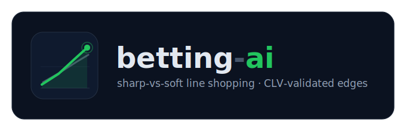

<div align="center">



**A picks-only +EV decision-support platform for football &amp; basketball.**

Sharp-vs-soft line shopping · vig-stripped edges · fractional-Kelly sizing · live Closing Line Value tracking.
You review every pick and place any bet yourself — the system never does.

[](pyproject.toml)
[](https://fastapi.tiangolo.com)
[](https://www.postgresql.org)
[](Dockerfile)
[](https://docs.astral.sh/ruff/)
[](https://github.com/alexandrosh8/sharp-ev-picks/actions/workflows/ci.yml)
[](#-safety--read-this-first)

[Install](#install--run) · [How it works](#how-it-works-backtested-positive-clv) · [Sports](#sports-coverage) · [Configuration](#configuration) · [Architecture](#architecture) · [Docs](#documentation)

</div>

---

## 🔒 Safety — read this first

> **This system never places bets.** It surfaces +EV picks for manual review; **you** decide and place any bet personally, on your own accounts.
>
> There is **no** bet-execution path, **no** bookmaker login automation, **no** stored betting credentials, and **no** auto-betting flag — by design. Every market-data integration is **read-only (GET)**. A CI safety audit (`scripts/safety_audit.sh`) fails the build if a bet-placement path ever appears. Recommended stakes, edges and EV are informational only — betting involves risk and nothing here is a guarantee of profit.

## How it works (backtested positive CLV)

The honest result of backtesting (`docs/backtesting/`): a goals model (Dixon-Coles) does **not** beat the market — negative CLV. But **sharp-vs-soft line shopping does** — price fair value from the sharpest book (Pinnacle), then bet a softer book whose price beats it.

The v3 maximal-data run (18 leagues × 7 seasons × two markets, **46k matches**; devig × edge threshold swept on TRAIN only, then a single pre-registered holdout) chose **shin devig, edge ≥ 0.03**. Held-out 2024–26:

| Tier                       | n   | ROI        | Incremental CLV       | Notes                                                                |
| -------------------------- | --- | ---------- | --------------------- | -------------------------------------------------------------------- |
| **Premium** (live default) | 62  | **+22.4%** | **+0.107** ( > 2 SE ) | positive even vs the Max-of-books close; 1X2 and OU2.5 each positive |
| Volume (shadow)            | 379 | +2.5%      | +0.019                | tracked, never alerted                                               |

> **Re-validated 2026-06-27** on fresh football-data.co.uk data through 2025/26 (46,221 matches): the held-out verdict reproduces — incremental CLV **+0.107 ( > 2 SE )**, ROI **+22.4%**, positive even vs the Max-of-books close — and it is robust to the devig choice (the production `--min-odds 1.6` config selects differential-margin at edge ≥ 0.03 and lands **+0.106 CLV / +21.1% ROI** on the same holdout). The baseline "bet everything" is flat/negative, so the edge is in the _selection_. Reproduce: `uv run python scripts/value_backtest.py`. The 18 European leagues are the full backtestable universe here — football-data.co.uk's non-European feeds are closing-odds-only, so the pre-match value method can't be run on them.

The number to trust is the **CLV** — small-sample ROI is noisy. **Football** has cleared that bar (held-out incremental CLV **> 2 SE**, table above). **Basketball** runs the _identical_ sharp-vs-soft method (moneyline + totals) but its **own** held-out CLV is **still accruing** — so basketball picks are mechanically sound, _not_ yet independently proven to football's bar. **Tennis and American football are under construction**: scraped and shown, but pick-free and exposure-free (enforced in both the scheduler and the warehouse path) until their closing-line evidence accrues.

The edge is only real **where a sharp price exists**. An optional, off-by-default gate (`VALUE_REQUIRE_SHARP_ANCHOR`) makes that structural: a premium pick must be priced against a genuine sharp anchor (Pinnacle or Betfair Exchange) — a candidate whose "fair" value came only from the soft-book consensus median is **demoted to the shadow tier** (persisted, CLV-tracked, never alerted, never reserving exposure). That scopes premium by _data_, not by a curated league list, so obscure-league bleed can't mint false +EV. A standing **fake-CLV independence guard** backs it: a closing line anchored by a pick's _own_ fill book (circular, `|clv| ≈ 0`) is flagged and excluded from the sharp CLV subset, so the metric that proves edge cannot be quietly faked.

The strategy is wired into the running app as the default (`PICK_STRATEGY=value`): the scheduler polls odds, strips vig (**8 devig methods**, parity-tested), gates +EV edges, sizes fractional Kelly, alerts, and a 30-minute **CLV true-up** refreshes each open pick's closing-line value — the live discipline that proves (or disproves) edge over time.

```bash
uv run python scripts/value_backtest.py     # reproduce the backtest
uv run python scripts/value_picks.py --league world-cup --min-edge 0.015
```

## Sports coverage

| Sport                                    | Status                       | Notes                                                                                                                        |
| ---------------------------------------- | ---------------------------- | ---------------------------------------------------------------------------------------------------------------------------- |
| **Football / Soccer**             | ✅ Pick source — **validated**      | Held-out CLV **> 2 SE** (1X2 + O/U 2.5). Sharp-vs-soft line shopping.                                        |
| **Basketball** (NBA / EuroLeague) | ⚠️ Pick source — **not yet proven** | Same sharp-vs-soft method (moneyline + totals); **no** basketball-specific held-out CLV yet — live CLV accruing. |
| **Tennis** (ATP / WTA)            | 🚧 **Under construction**           | Scraped + shown for the games view; mints **no** picks (no free sharp close to validate against yet).        |
| **American football** (NFL)       | 🚧 **Under construction**           | Scraped + shown; mints **no** picks — forward-capturing the Pinnacle close until CLV can be graded.          |

> **Getting odds ≠ getting picks.** A sport is shown the moment it's scrapeable, but its picks are only trustworthy once its _own_ closing-line evidence proves an edge. Only **football** has cleared that bar; **basketball** runs the same method with evidence still accruing; **tennis and American football are under construction** (scraped + shown, no picks).

## Install &amp; run

Both supported paths run the **same code** and serve the picks dashboard at **http://localhost:8000/**.

### Option 1 — Your own PC (Windows or Mac)

**Docker Desktop** runs the whole stack (app + Postgres + Redis) with one command — no Python, no database to install.

1. Install **[Docker Desktop](https://www.docker.com/products/docker-desktop/)** and start it.
2. Get the code and a config file:

   ```bash
   git clone https://github.com/alexandrosh8/sharp-ev-picks.git
   cd sharp-ev-picks
   cp .env.example .env          # Windows PowerShell: Copy-Item .env.example .env
   ```

3. Build and start (the first build downloads Chromium — a few minutes):

   ```bash
   docker compose --profile prod up -d --build
   ```

4. Open **http://localhost:8000/**.

Stop with `docker compose --profile prod down` (data is kept in a Docker volume); restart with `docker compose --profile prod up -d`. Logs: `docker compose --profile prod logs -f app`.

On first launch the dashboard shows a one-time **setup screen** to create your admin password (stored hashed, never in the file). Prefer no login on your own PC? Set `DASHBOARD_AUTH_ENABLED=false` in `.env`.

### Option 2 — Ubuntu VPS / OpenClaw (always-on, 24/7)

The same Docker stack on a server, with `restart: unless-stopped` so it survives reboots and crashes:

```bash
sudo apt install -y docker.io docker-compose-v2 git      # if Docker is missing
sudo git clone https://github.com/alexandrosh8/sharp-ev-picks.git /opt/sharp-ev-picks
sudo chown -R $USER /opt/sharp-ev-picks
cd /opt/sharp-ev-picks
cp .env.example .env
chmod 600 .env
# edit .env: uncomment COMPOSE_PROFILES=prod, set TELEGRAM_*; create the /setup
# password over an SSH tunnel BEFORE exposing the port. Public IP? set APP_HOST_BIND=0.0.0.0
docker compose up -d --build
```

Reach it over an SSH tunnel (`ssh -L 8000:127.0.0.1:8000 <vps>`, then http://localhost:8000/), or on the VPS IP once dashboard auth is on. Full runbook — every `.env` key, public-IP hardening, logs, backups, troubleshooting: **[`docs/deployment/openclaw-ubuntu.md`](docs/deployment/openclaw-ubuntu.md)**.

### Mac / Linux — run natively (no Docker)

On a Mac you don't need Docker at all — run the app **and** its services directly on the host. Install Postgres + Redis once with Homebrew:

```bash
brew install postgresql@16 redis
brew services start postgresql@16
brew services start redis
createdb betting_ai                          # match POSTGRES_DB / DATABASE_URL in .env

uv sync --extra football --extra backfill    # NBA: also --extra nba --extra models --extra ml
uv run playwright install chromium           # only if ODDSPORTAL_USE_JSON_FEED=false (Playwright transport)
uv run alembic upgrade head
uv run uvicorn app.main:app --reload         # http://localhost:8000/  (hot-reload)
```

Prefer not to install the databases? Run just those two in Docker and keep the app native: `docker compose up -d postgres redis`.

New here? **[`docs/HOW_TO_RUN.md`](docs/HOW_TO_RUN.md)** has the exact verify-the-backtest and live-picks commands. Common dev tasks:

```bash
uv run pytest -q                 # tests (no network; httpx.MockTransport + fakeredis)
uvx ruff check .                 # lint
uv run mypy app tests            # types
bash scripts/safety_audit.sh     # no-autobet + secret-leak greps (CI-gated)
```

## Configuration

All secrets live in `.env` only (copy from `.env.example`; `.env` is `0600` and gitignored — **never commit it**). Highlights:

| Key                                       | Default      | What it does                                                                             |
| ----------------------------------------- | ------------ | ---------------------------------------------------------------------------------------- |
| `ODDS_SOURCE`                             | `oddsportal` | Free OddsPortal scrape (default) or `odds_api` (The Odds API, includes Pinnacle).        |
| `ODDSPORTAL_USE_JSON_FEED`                | `false`      | Selectable per-match odds transport: `false` = proven Playwright render; `true` = a `curl_cffi` JSON-feed reader (see below). |
| `VALUE_REQUIRE_SHARP_ANCHOR`              | `false`      | When `true`, a premium pick without a real Pinnacle/Betfair anchor demotes to the shadow tier (consensus-only never alerts).  |
| `DASHBOARD_AUTH_ENABLED`                  | `true`       | First-run `/setup` creates the admin password (stored hashed). `false` = no login.       |
| `TELEGRAM_BOT_TOKEN` / `TELEGRAM_CHAT_ID` | empty        | Pick alerts. Blank just disables alerts; the dashboard still works.                      |
| `SCRAPER_PROXY_POOL`                      | empty        | Optional rotating proxy pool for the scrape — see below.                                 |
| `BETFAIR_EXCHANGE_ENABLED`                | `false`      | Optional read-only Betfair Exchange BACK-odds capture — see below.                       |
| `SCRAPE_NAV_TIMEOUT_MS`                   | `30000`      | Per-match-page navigation timeout (ms); raise on a slow VPS (floor `15000`).             |
| `RESULTS_SCRAPE_INTERVAL_SECONDS`         | `900`        | Cadence of the dedicated finished-score job that settles results promptly.               |
| `RESULTS_SCRAPE_LINK_TIMEOUT_SECONDS`     | `90`         | Per-match-page timeout for the score scrape (one hung proxy can't stall the pass).       |
| `RESULTS_SCRAPE_CYCLE_BUDGET_SECONDS`     | `600`        | Per-cycle wall-clock budget for the score scrape; remainder drains next cycle.           |
| `RESULTS_SCRAPE_WINDOW_DAYS`              | `14`         | Re-scrape stale, unscored finished picks this far back (clears stuck "awaiting result"). |

> **All env keys ship with safe defaults — production works with none of them set.** The four scrape-tuning rows above matter mainly on a slow VPS/proxy: a dedicated, time-boxed finished-score job commits each game's score as it's scraped, so a slow odds pass can't leave finished picks stuck on "awaiting result" on the deployed site.

### Rotating scrape proxies (optional)

The free OddsPortal scrape runs from your host IP — which OddsPortal can throttle (empty pages) and which only lists _your_ region's books (often a thin, crypto-heavy set). A proxy pool fixes both: rotate the outbound IP and exit via a deeper-market region — a **UK** exit lists ~18 mainstream books (Sky Bet, William Hill, bet365…) vs ~5 region-restricted.

```bash
# .env — comma-separated host|port|user|pass quads. Empty = host IP.
SCRAPER_PROXY_POOL=host1|port1|user1|pass1,host2|port2|user2|pass2
```

On the JSON-feed transport each match's GETs exit a **different** IP (round-robin) and a fetch error **fails over** to the next proxy; `ODDSPORTAL_CONCURRENCY` is capped at `max(5, pool size)` so every concurrent request lands on a distinct IP (this took a full-slate cycle from tens of minutes to ~4). Read-only — only the outbound IP of GET requests changes; creds live in `.env`, never in a logged URL. (A UK exit hides Pinnacle, which is UK-restricted; the sharp anchor is the free Pinnacle **ARCADIA** close, not the scrape.) The **same pool doubles as the Arcadia egress**: ARCADIA 403s datacenter/direct IPs, so without a proxy the Pinnacle close can't be captured at all — when `ARCADIA_PROXY_URLS` is unset the client reuses `SCRAPER_PROXY_POOL` automatically.

### JSON-feed odds transport (optional, faster)

`ODDSPORTAL_USE_JSON_FEED=true` swaps the per-match Playwright (Chromium) render for a read-only `curl_cffi` client (`app/ingestion/oddsportal_json.py`) that fetches OddsPortal's encrypted odds feed (AES-256-CBC) and parses it directly — **no per-match render** (the chronic CPU/latency cost); team/league/kickoff come from the dated listing. Provider ids resolve to canonical bookmaker **names** via a static in-repo map (`oddsportal_bookmakers.py`); an unknown id is **skipped, never persisted numeric** (a numeric book would break sharp/soft classification + the CLV join). A feed miss is a logged scrape gap and **skipped** — no Playwright fallback on this path, so a key/bundle rotation fails closed, loudly. Read-only GET either way; `false` keeps the proven Playwright render.

### Betfair Exchange capture (optional second sharp anchor)

An off-by-default, read-only reader (`app/ingestion/betfair_exchange.py`, [ADR-0015](docs/adr/adr-0015-betfair-exchange-back-odds-capture.md)) captures Betfair Exchange BACK odds from the **same** OddsPortal match page as the soft books, so it binds **inline on the canonical event** — no cross-source matching, no wrong-game risk. Coverage is liquidity-gated and seasonal (~65% of priced games on a full slate, thinner off-season). Set `BETFAIR_EXCHANGE_ENABLED=true`.

### Built, tested, default-off (in-season activation)

A set of sharper-pricing and risk knobs are implemented and unit-tested but ship **OFF** so the live path stays bit-for-bit identical to the validated backtest; the in-season move is **shadow-first** activation (track, don't alert), then promote only if its own CLV holds. None can raise a stake or mint a pick on its own.

- **Log-odds (logit) consensus anchor** — a non-extremizing logit pool across full-market books instead of the median-of-prices consensus (`app/edge/value.py:_logit_consensus_anchor`, `consensus_logit_pool`).
- **Probit devig + Shin closed form** — probit for symmetric markets (totals / Asian handicap) and the exact 2-outcome Shin solution (`app/probabilities/devig.py`).
- **Exchange-liquidity gate on sharp anchors** — a thin / just-firmed Betfair line can't earn `sharp` grade unless matched liquidity clears a floor on every selection (`app/edge/value.py`, `exchange_min_liquidity`).
- **Edge-uncertainty Kelly shrink + correlation haircut** — a noisier fair-prob estimate is staked smaller, and correlated same-slate legs take a diversification haircut (`app/risk/staking.py:uncertainty_multiplier` / `correlation_haircut`); both can only shrink, never raise.
- **CLV line-drift time-series** — `CLV_RECORD_DRIFT=true` appends each open-pick re-price to the new `pick_line_drift` table, building the full bet-time→close drift path (default off keeps the table empty).

## Architecture

The live spine uses proven open-source engines directly, bound into one pipeline:

- **OddsHarvester** scrapes free pre-match odds from oddsportal.com → `app/ingestion/oddsportal.py` (read-only; OddsPortal is an aggregator, not a bookmaker). Per-match odds use the Playwright render by default, or an optional `curl_cffi` JSON-feed reader (`app/ingestion/oddsportal_json.py`, `ODDSPORTAL_USE_JSON_FEED=true`) that skips the per-match render with a static bookmaker id→name map.
- **penaltyblog** Dixon-Coles prices football, fitted on free football-data.co.uk history → `app/models/football_dc.py`.
- The app owns the **+EV core**: an **8-method devig** (`app/probabilities/devig.py`, parity-tested 1e-8 — multiplicative, additive, power, Shin, **probit**, odds-ratio, logarithmic, differential-margin), edge/EV gate (`app/edge/value.py`), fractional-Kelly sizing with exposure caps (`app/risk/`), and a precision-hardened cross-source matcher (`app/resolution/`) for CLV resolution — marker/reserve-aware (women/youth/reserve sides never collapse onto the senior team), two-tier Jaro-Winkler on marker-stripped base names over an expanded alias seed (CC0 Wikidata + fixture-confirmed exotic hand-maps), with a tight kickoff window. Probit (inverse-normal constant shift) is the best fit on **symmetric markets** — totals / Asian handicap — and Shin uses the exact 2-outcome closed form (Jullien-Salanié), no solver. A read-only **wrong-game self-audit** (`app/maintenance/wrong_game_audit.py`) independently re-verifies accepted sharp anchors each cycle and logs any same-game violation, since a wrong-game close is fake CLV.
- **Sharp anchors:** the free Pinnacle ARCADIA close (`app/ingestion/pinnacle_arcadia.py`, hardened matcher on the live anchor path), and optionally Betfair Exchange BACK odds (bound inline on the canonical event) — both read-only. **ARCADIA 403s any datacenter/direct egress, so capture requires a proxy**: the client rotates the dedicated `ARCADIA_PROXY_URLS`, or — when that's unset — falls back to the shared `SCRAPER_PROXY_POOL` (`Settings.arcadia_effective_proxy_urls`), so one proxy pool keeps the sharp archive flowing. Without a proxy, `/sports` discovery 403s and the Pinnacle archive stays empty. Live-anchor coverage is **gradual and off-season-thin**: the edge is claimed only where a real sharp price actually backs the pick.
- Picks persist to **Postgres** (SQLAlchemy 2.0 async + Alembic, **16-table warehouse** — `pick_line_drift` added for CLV drift history) and serve via `GET /picks`; **APScheduler** drives polling, settlement, CLV true-up, and the sharp-anchor captures; **FastAPI** serves the self-contained **TAPE** dashboard.

**Stack:** Python 3.12 · FastAPI · SQLAlchemy 2.0 async + asyncpg · APScheduler · Redis · PostgreSQL · Playwright (Chromium) · Docker Compose. Pure-math modules (`probabilities`, `edge`, `risk`) take no env/DB/HTTP — policies enter as frozen dataclasses at the composition root.

```bash
export ODDS_SOURCE=oddsportal
export ODDSPORTAL_FOOTBALL_LEAGUES=brazil-serie-a
export FOOTBALLDATA_NEW_LEAGUE_CODE=BRA          # train DC on Brazil history
uv run uvicorn app.main:app
open http://localhost:8000/                       # the picks dashboard
```

## Project status

- [x] Validated pick finder — sharp-vs-soft value strategy, v3 maximal-data backtest (46k matches, holdout incremental CLV > 2 SE), wired as the default live pipeline with 30-min CLV true-up (1000+ tests).
- [x] Settlement engine — soccer auto-settles from free results feeds; NBA/EuroLeague settle manually; the dashboard SETTLED view shows the final **Score** + result + P&amp;L + CLV, and the manual settle prompt **pre-fills** the scraped final score when available.
- [x] Sharp anchors — free Pinnacle ARCADIA close (forward-captured), now resolved by a precision-hardened, marker/reserve-aware matcher (two-tier Jaro-Winkler + expanded aliases) on the live anchor path, with a wrong-game self-audit net; plus optional Betfair Exchange BACK odds bound inline on the canonical event (off-by-default, ~65% of priced games on a full slate, thinner off-season).
- [x] +EV hardening — optional `VALUE_REQUIRE_SHARP_ANCHOR` gate (consensus-only premium demotes to shadow) + structural safeguards: a fake-CLV independence guard (circular fill-as-close excluded from the sharp subset), a no-sharp-anchor⇒no-premium invariant test, a report-only claimed-fair calibration monitor, and headline min-n suppression so thin samples never publish a misleading ROI.
- [x] Calibration verdict — the devigged fair prob is **already calibrated**: a leakage-free walk-forward recalibration-gain detector (`app/backtesting/calibration.py:walk_forward_beta_gain`) plus a 6-agent adversarial verification found **no** transform (shrinkage / beta-Platt / isotonic / FLB-tempering) that beats identity out-of-sample (full-pool +0.002%, the edge-conditional residual is conservative), so the proposed "tail-bias haircut" is **not warranted** — shipping one would degrade log-loss and demote +EV picks. A standing probe (`scripts/ml/calibration_haircut_probe.py`) re-checks as live volume grows. See [`docs/research/calibration-haircut-decision-2026-06-24.md`](docs/research/calibration-haircut-decision-2026-06-24.md).
- [x] OddsPortal JSON-feed transport — optional `curl_cffi` per-match reader (`ODDSPORTAL_USE_JSON_FEED=true`) that drops the per-match Playwright render, with a static in-repo bookmaker id→name map and no silent numeric-bookmaker fallback (read-only GET).
- [x] Multisport visibility — Tennis (ATP/WTA) + American football (NFL/NCAA/CFL) as visibility-only feeds (scraped, shown `UNVALIDATED`, no picks); per-sport CLV-readiness probe; tennis surname-initial name reconciliation + CC0 cross-source alias seed for soccer coverage.
- [x] Dashboard **TAPE** — a self-contained sharp trading-desk terminal (`app/api/dashboard.html`, no CDN, offline-capable, installable PWA). A full-width **THE CLOSE** hero leads with the closing-line story (big stake-weighted-CLV headline + an `n/50` proof-accrual meter + a beat-close distribution histogram, with an honest "accruing" fallback when the sharp sample is thin); a two-pane **Command Deck** (left = live picks TAPE, right = proof ledger); the signature per-pick **beat-the-close DRIFT BAR** (open → fill → close/now on one odds axis, +EV gap shaded green / value-gone red, CLV called out); a stratified live-evidence panel; a persisted sort control; a sticky mobile **bottom tab bar** over four views — **Live / Unverified / Closed / Results**. Warm-charcoal + bone palette, one +EV-green signal, monospace data, squared corners; first-run `/setup` admin password stored hashed.
- [x] Pinnacle ARCADIA proxy fix — the single biggest live-coverage win: ARCADIA 403s datacenter/direct egress, so capture now routes through a proxy (dedicated `ARCADIA_PROXY_URLS`, or an automatic fall-back to the shared `SCRAPER_PROXY_POOL` via `arcadia_effective_proxy_urls`), with 403 treated as "rotate egress" and retried. Without it `/sports` discovery failed and the sharp archive stayed empty.
- [x] Build-order capabilities (built + tested, default-off; shadow-first for in-season) — logit consensus anchor, probit devig + Shin closed form, an exchange-liquidity gate on sharp anchors, an edge-uncertainty Kelly shrink + correlation-aware haircut, and a `pick_line_drift` CLV drift time-series (`CLV_RECORD_DRIFT`). None can raise a stake or mint a pick.
- [x] Resolution matcher — marker/reserve-aware, two-tier Jaro-Winkler on marker-stripped base names, over an expanded alias seed (CC0 Wikidata altLabels + fixture-confirmed exotic hand-maps) that lifts off-season/exotic-slate sharp-anchor coverage; backed by the read-only wrong-game self-audit.
- [x] Rotating scrape proxies — optional `SCRAPER_PROXY_POOL` (rotation + capped failover, off by default) widening soft-book coverage (~18 UK books vs ~5 from a region-restricted IP). Read-only; creds in `.env` only.
- [x] Scrape throughput + correctness — per-match proxy rotation on the JSON feed (each match exits a different IP) with retry-failover, plus a proxy-budget concurrency validator (≥1 proxy per concurrent request), cut a full-slate cycle from >60 min to ~4 min so odds refresh every few minutes and the freshness gate no longer discards the slate. Plus a soccer 1X2 feed-order fix, a max-edge data-error cap, and a fail-safe double-chance derivation guard (skips DC if the H2H anchor order is ever non-canonical).
- [ ] Next: bankroll tracking (phase 6) + a validated NBA model (phase 5).

## Documentation

| Path                                       | Contents                                                 |
| ------------------------------------------ | -------------------------------------------------------- |
| [`docs/adr/`](docs/adr/)                   | Architecture decision records                            |
| [`docs/research/`](docs/research/)         | Repository &amp; data-source research logs               |
| [`docs/backtesting/`](docs/backtesting/)   | Backtesting methodology &amp; results                    |
| [`docs/deployment/`](docs/deployment/)     | Mac dev + Ubuntu/OpenClaw deployment guides              |
| [`docs/security/`](docs/security/)         | Security notes &amp; reviews                             |
| [`docs/HOW_TO_RUN.md`](docs/HOW_TO_RUN.md) | End-to-end verify-the-backtest &amp; live-picks commands |

## License

[MIT](LICENSE) © 2026 alexandrosh8 — free to use, modify, and distribute; provided "as is", without warranty.

---

<div align="center"><sub>Picks-only decision support · read-only market data · never places bets.</sub></div>
