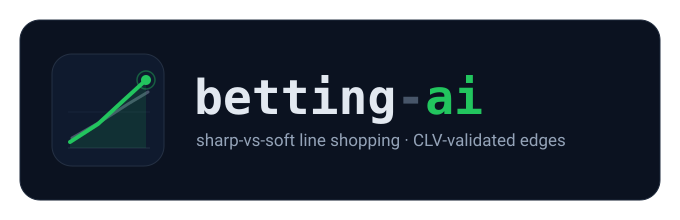

<div align="center">



**A picks-only +EV decision-support platform for football &amp; basketball.**

Sharp-vs-soft line shopping · vig-stripped edges · fractional-Kelly sizing · live Closing Line Value tracking.
You review every pick and place any bet yourself — the system never does.

[](pyproject.toml)
[](https://fastapi.tiangolo.com)
[](https://www.postgresql.org)
[](Dockerfile)
[](https://docs.astral.sh/ruff/)
[](https://github.com/alexandrosh8/sharp-ev-picks/actions/workflows/ci.yml)
[](#-safety--read-this-first)

[Install](#install--run) · [How it works](#how-it-works) · [Sports](#sports-coverage) · [Configuration](#configuration) · [Architecture](#architecture) · [Docs](#documentation)

</div>

---

## 🔒 Safety — read this first

> **This system never places bets.** It surfaces +EV picks for manual review; **you** decide and place any bet personally, on your own accounts.
>
> There is **no** bet-execution path, **no** bookmaker login automation, **no** stored betting credentials, and **no** auto-betting flag — by design. Every market-data integration is **read-only (GET)**. A CI safety audit (`scripts/safety_audit.sh`) fails the build if a bet-placement path ever appears. Recommended stakes, edges and EV are informational only — betting involves risk and nothing here is a guarantee of profit.

## How it works

The honest backtest result (`docs/backtesting/`): a goals model (Dixon-Coles) does **not** beat the market on its own — negative CLV. **Sharp-vs-soft line shopping does**: price fair value from the sharpest book (Pinnacle), strip the vig, and surface a pick only when a softer book's price materially beats that fair value.

Backtested on 18 European leagues × 7 seasons × two markets (**46k matches**; parameters swept on TRAIN only, then a single pre-registered holdout). Held-out 2024–26:

| Tier                       | n   | ROI        | Incremental CLV       | Notes                          |
| -------------------------- | --- | ---------- | --------------------- | ------------------------------ |
| **Premium** (live default) | 62  | **+22.4%** | **+0.107** ( > 2 SE ) | 1X2 and O/U 2.5 each positive  |
| Volume (shadow)            | 379 | +2.5%      | +0.019                | tracked, never alerted         |

> **Read the headline as an upper bound, not the live expectation** (backtest-honesty audit, 2026-07-01). The numbers above fill at the **gross Max across all books** (exchanges included), while live fills at the best soft book or an exchange net of commission — a soft-book-only variant exists (`--fill-universe soft`). The original "> 2 SE" also treated correlated same-match picks as independent; the backtest verdict now gates on a **cluster-robust (by-match) SE**. The 2025 holdout is spent ([ADR-0019](docs/adr/)), and the pre-registered single-shot on fresh 2026 data (2026-07-02) **did not meet acceptance** — the held-out sample at frozen thresholds was tiny (n=13 for 1X2, n=3 for O/U 2.5, vs the n≥150 bar) with point-negative CLV, alongside a 2026-window fill-coverage anomaly (see `docs/research/2026-07-02-fresh-2026-single-shot-header.md`). The strategy is neither re-validated nor refuted by that run; live sharp-close CLV accrual remains the primary evidence path.

The number to trust is **CLV** — small-sample ROI is noisy. The edge is only claimed **where a real sharp price exists**: a premium candidate priced only from soft-book consensus can be demoted to the shadow tier (`VALUE_REQUIRE_SHARP_ANCHOR`), exchange anchors must clear a liquidity floor, and a **fake-CLV independence guard** excludes any closing line anchored by a pick's own fill book — so the metric that proves edge cannot be quietly faked.

Live, the scheduler polls odds, strips vig (8 parity-tested devig methods), gates +EV edges, sizes fractional Kelly, alerts, and a 30-minute **CLV true-up** refreshes each open pick's closing-line value — the discipline that proves (or disproves) edge over time.

## Sports coverage

A sport is *shown* the moment it's scrapeable, but it only *mints picks* once its own closing-line evidence proves an edge.

| Sport                             | Status                              | Notes                                                                                              |
| --------------------------------- | ----------------------------------- | -------------------------------------------------------------------------------------------------- |
| **Football / Soccer**             | ✅ Pick source — **validated**      | Held-out CLV **> 2 SE** (1X2 + O/U 2.5). Sharp-vs-soft line shopping.                              |
| **Basketball** (NBA / EuroLeague) | ⚠️ Shadow — **not yet proven**      | Same method (moneyline + totals); basketball-specific held-out CLV still accruing. Promotion requires evidence review, not an env flip. |
| **Tennis** (ATP / WTA)            | 🚧 Display-only                     | Scraped + shown; mints **no** picks (no free sharp close to validate against yet).                 |
| **American football** (NFL)       | 🚧 Display-only                     | Scraped + shown; mints **no** picks — forward-capturing the Pinnacle close until CLV can be graded. |

## Install &amp; run

Both supported paths run the **same code** and serve the picks dashboard at **http://localhost:8000/**.

### Option 1 — Your own PC (Windows or Mac)

**Docker Desktop** runs the whole stack (app + Postgres + Redis) with one command:

```bash
git clone https://github.com/alexandrosh8/sharp-ev-picks.git
cd sharp-ev-picks
cp .env.example .env          # Windows PowerShell: Copy-Item .env.example .env
docker compose --profile prod up -d --build
```

Open **http://localhost:8000/**. On first launch a one-time **setup screen** creates your admin password (stored hashed). Stop with `docker compose --profile prod down` (data survives in a Docker volume); logs via `docker compose --profile prod logs -f app`.

### Option 2 — Ubuntu VPS (always-on, 24/7)

The same Docker stack with `restart: unless-stopped`:

```bash
sudo apt install -y docker.io docker-compose-v2 git
sudo git clone https://github.com/alexandrosh8/sharp-ev-picks.git /opt/sharp-ev-picks
sudo chown -R $USER /opt/sharp-ev-picks
cd /opt/sharp-ev-picks
cp .env.example .env
chmod 600 .env
# edit .env (COMPOSE_PROFILES=prod, TELEGRAM_*); create the /setup password
# over an SSH tunnel BEFORE exposing the port
docker compose up -d --build
```

Reach it over an SSH tunnel (`ssh -L 8000:127.0.0.1:8000 <vps>`), or on the VPS IP once dashboard auth is on. Full runbook: [`docs/deployment/openclaw-ubuntu.md`](docs/deployment/openclaw-ubuntu.md).

### Mac / Linux — run natively (no Docker)

```bash
brew install postgresql@16 redis
brew services start postgresql@16
brew services start redis
createdb betting_ai

uv sync --extra football --extra backfill    # NBA: also --extra nba --extra models --extra ml
uv run alembic upgrade head
uv run uvicorn app.main:app --reload         # http://localhost:8000/
```

Prefer not to install the databases? `docker compose up -d postgres redis` and keep the app native. First-time commands live in [`docs/HOW_TO_RUN.md`](docs/HOW_TO_RUN.md). Dev tasks:

```bash
uv run pytest -q                 # 2,000+ tests (no network)
uvx ruff check .                 # lint
uv run mypy app tests            # types
bash scripts/safety_audit.sh     # no-autobet + secret-leak greps (CI-gated)
```

## Configuration

All secrets live in `.env` only (copy from `.env.example`; `0600`, gitignored — **never commit it**). Every key ships with a safe default — the app works with none of them set. The keys that matter most:

| Key                                       | Default                | What it does                                                                             |
| ----------------------------------------- | ---------------------- | ---------------------------------------------------------------------------------------- |
| `ODDS_SOURCE`                             | `oddsportal`           | Free OddsPortal scrape (default) or `odds_api` (The Odds API).                            |
| `DASHBOARD_AUTH_ENABLED`                  | `true` in `.env.example` | First-run `/setup` creates the admin password (stored hashed). `false` = no login.      |
| `TELEGRAM_BOT_TOKEN` / `TELEGRAM_CHAT_ID` | empty                  | Pick alerts. Blank just disables alerts; the dashboard still works.                       |
| `VALUE_REQUIRE_SHARP_ANCHOR`              | `false`                | When `true`, a premium pick without a real Pinnacle/Betfair anchor demotes to shadow.     |
| `SCRAPER_PROXY_POOL`                      | empty                  | Optional rotating proxies for the scrape *and* the Pinnacle close capture (see below).    |
| `BETFAIR_EXCHANGE_ENABLED`                | `false`                | Optional read-only Betfair Exchange BACK-odds capture as a second sharp anchor.           |
| `ODDSPORTAL_USE_JSON_FEED`                | `false`                | `true` swaps the per-match Playwright render for a faster `curl_cffi` JSON-feed reader.   |

The full key reference (scrape tuning, timeouts, results-settlement cadence) is documented inline in [`.env.example`](.env.example).

**Scrape proxies.** The free OddsPortal scrape runs from your host IP, which can be throttled and only lists your region's books. A rotating pool (`host|port|user|pass` quads, comma-separated) widens coverage (~18 UK mainstream books vs ~5 region-restricted) and speeds a full slate to minutes. The same pool automatically serves as egress for the free **Pinnacle ARCADIA close capture**, which rejects datacenter/direct IPs — without a proxy the sharp-close archive stays empty. Read-only either way; credentials never leave `.env`.

**Betfair Exchange.** An off-by-default, read-only capture ([ADR-0015](docs/adr/adr-0015-betfair-exchange-back-odds-capture.md)) binds Betfair BACK odds inline on the same canonical event as the soft books — no cross-source matching, no wrong-game risk. Exchange anchors are liquidity-gated (a known-thin line can't serve as the sharp anchor).

## Architecture

Proven open-source engines bound into one pipeline:

- **Ingestion** — OddsHarvester-based OddsPortal scrape (`app/ingestion/oddsportal.py`, Playwright render or `curl_cffi` JSON feed); free Pinnacle ARCADIA close capture (`app/ingestion/pinnacle_arcadia.py`); optional Betfair Exchange BACK odds. All read-only.
- **Pricing** — penaltyblog Dixon-Coles for football (`app/models/football_dc.py`); an 8-method devig (`app/probabilities/devig.py` — multiplicative, additive, power, Shin closed-form, probit, odds-ratio, logarithmic, differential-margin; parity-tested to 1e-8).
- **Edge &amp; risk** — edge/EV gating (`app/edge/value.py`) with sharp/consensus anchor grading and an exchange-liquidity floor; fractional-Kelly sizing with per-pick and daily exposure caps (`app/risk/`).
- **Resolution** — a precision-hardened cross-source matcher (`app/resolution/`) for CLV: marker/reserve-aware (women/youth/reserve sides never collapse onto the senior team), two-tier Jaro-Winkler over a curated alias seed, tennis surname-initial veto, tight kickoff windows, plus a read-only wrong-game self-audit each cycle.
- **Persistence &amp; serving** — Postgres warehouse (SQLAlchemy 2.0 async + Alembic); APScheduler drives polling, settlement, CLV true-up and sharp-close captures; FastAPI serves the dashboard.
- **Dashboard** — a single self-contained file (`app/api/dashboard.html`; no framework, no CDN, installable PWA). Mobile-first, four sections — **Picks / Games / Performance / Diagnostics** — with a trust status bar (health, freshness, premium/shadow counts, ROI, CLV), explicit state badges (Premium, Shadow "tracked — not actionable", stale, display-only, weak/missing anchor, settlement, CLV), and honest empty/error states. Diagnostics explains *why* the board is quiet.

**Stack:** Python 3.12 · FastAPI · SQLAlchemy 2.0 async + asyncpg · APScheduler · Redis · PostgreSQL · Playwright (Chromium) · Docker Compose. Pure-math modules (`probabilities`, `edge`, `risk`) take no env/DB/HTTP — policies enter as frozen dataclasses at the composition root.

## Status

Football is the validated live pick source (held-out incremental CLV > 2 SE, wired as the default pipeline with a 30-minute CLV true-up). Basketball runs the identical method in shadow while its own evidence accrues; tennis and NFL are display-only. Settlement is automatic from free results feeds, with wrong-game, retirement/walkover and extra-time guards. 2,000+ tests, typed end-to-end, CI-gated safety audit. Roadmap: bankroll tracking, then a validated NBA model.

## Documentation

| Path                                       | Contents                                                 |
| ------------------------------------------ | -------------------------------------------------------- |
| [`docs/adr/`](docs/adr/)                   | Architecture decision records                            |
| [`docs/research/`](docs/research/)         | Repository &amp; data-source research logs               |
| [`docs/backtesting/`](docs/backtesting/)   | Backtesting methodology &amp; results                    |
| [`docs/deployment/`](docs/deployment/)     | Mac dev + Ubuntu/OpenClaw deployment guides              |
| [`docs/security/`](docs/security/)         | Security notes &amp; reviews                             |
| [`docs/HOW_TO_RUN.md`](docs/HOW_TO_RUN.md) | End-to-end verify-the-backtest &amp; live-picks commands |

## License

[MIT](LICENSE) © 2026 alexandrosh8 — free to use, modify, and distribute; provided "as is", without warranty.

---

<div align="center"><sub>Picks-only decision support · read-only market data · never places bets.</sub></div>
