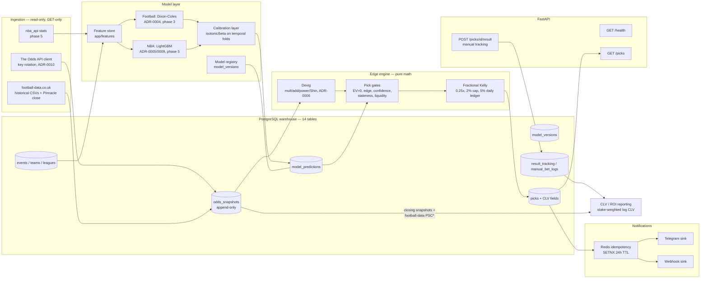

# Architecture — Manual-Betting +EV Picks Platform

> Picks-only decision support. No component places bets; no execution code
> path exists (ADR-0002). All market-data integrations are read-only.

## System diagram



Cross-cutting: Redis (alert idempotency, future cache), APScheduler in-process
jobs (ADR-0007), structured stdout logging (UTC), Docker Compose
(postgres:16 + redis:7; app container in production).

## Component responsibilities

| Component     | Code                                  | Responsibility                                                                                                                |
| ------------- | ------------------------------------- | ----------------------------------------------------------------------------------------------------------------------------- |
| Ingestion     | `app/ingestion/`                      | Read-only async clients; retry on transport errors only; key rotation; secret scrubbing; snapshot dedupe; staleness flagging  |
| Warehouse     | `app/storage/`, `alembic/`            | 14-table schema (docs/db-schema.md); append-only odds; NUMERIC money/odds; TIMESTAMPTZ everywhere                             |
| Feature store | `app/features/`                       | Leakage-safe feature builders (shift-1 rolling windows, as-of joins) — phases 3/5                                             |
| Models        | `app/models/`                         | `ProbabilityModel` protocol; Dixon-Coles (football), LightGBM (NBA); every artifact registered in `model_versions`            |
| Calibration   | `app/models/`                         | Isotonic/beta fitted on temporally disjoint folds; Brier/log-loss/ECE gates before any league goes live                       |
| Edge engine   | `app/probabilities/`, `app/edge/`     | Pure math: devig → edge/EV → named-reason gates                                                                               |
| Risk          | `app/risk/`                           | Fractional Kelly with transparent decomposition; per-bet cap; daily exposure ledger                                           |
| Pipeline      | `app/pipeline.py`, `app/scheduler.py` | Composition root: poll → devig → model join → gates → stake → alert                                                           |
| Notifications | `app/notifications/`                  | Idempotent dispatch (Redis SETNX); Telegram + webhook sinks that never raise; every alert carries the manual-betting reminder |
| API           | `app/api/`                            | `GET /picks`, `POST /picks/{id}/result` (manual tracking), `GET /health`                                                      |
| Backtesting   | `app/backtesting/`                    | CLV math (log-ratio, stake-weighted), bankroll path, ROI, drawdown; walk-forward harness in phase 3                           |

## Data flow narrative (one polling cycle)

1. APScheduler fires `poll_odds` (default 300 s; credit-frugal cadence per
   ADR-0010 — denser only near kickoff).
2. The Odds API client fetches the slate (`regions=eu` includes Pinnacle),
   parses to `OddsSnapshotIn`, appends to `odds_snapshots`
   (ON CONFLICT DO NOTHING on the observation key).
3. Each (event, bookmaker, market) book is devigged with the ADR-0006 method →
   fair probabilities.
4. Model predictions for the event are joined on (market, selection);
   candidates are evaluated against the gates: `EV > 0 ∧ EV ≥ MIN_EV ∧
edge ≥ MIN_EDGE ∧ confidence ≥ MIN_CONFIDENCE ∧ age ≤ MAX_ODDS_AGE_SECONDS
∧ liquidity ≥ MIN_LIQUIDITY`. Every decision (accept or named-reason
   reject) is auditable (`detected_edges`).
5. Accepted candidates get a stake recommendation: raw Kelly → ×0.25 → 2 %
   per-bet cap → 5 % daily-exposure ledger clip. Stake is informational only.
6. The pick persists with its full diagnostics; the alert (all master-prompt
   fields + "Manual review required. This system does not place bets.")
   passes the Redis idempotency gate and fans out to Telegram/webhook.
7. Near kickoff a final snapshot is flagged `is_closing`; football CLV is
   later trued-up against football-data.co.uk Pinnacle closing columns; NBA
   CLV uses the self-captured close (ADR-0010).
8. The user records what they did via `POST /picks/{id}/result` →
   `manual_bet_logs` + `result_tracking` → ROI and stake-weighted log-CLV
   reporting.

## Edge engine formula spec

```text
implied_probability        q_i = 1 / d_i
overround                  B   = Σ q_i − 1
fair probabilities         p   = devig(d, method per ADR-0006)
edge                       edge = p_model − p_fair
expected value (per unit)  EV   = p_model · (d − 1) − (1 − p_model)
kelly fraction             f*   = ((d − 1) · p_model − (1 − p_model)) / (d − 1)
recommended fraction       f    = min(0.25 · f*, 0.02), then daily ledger ≤ 0.05
clv (log)                  clv  = ln(d_fill · p_close_fair)
```

A pick exists only when every gate passes; the stake is a recommendation —
the user decides and places any bet manually.

## Deployment shape

- **Stage 1 (Mac, now):** `docker compose up -d postgres redis` (host ports
  5433/6380), app on host via `uv run uvicorn app.main:app`.
- **Stage 2 (Ubuntu + OpenClaw):** full compose incl. the `app` service
  (profile `prod`), `restart: unless-stopped`, `.env` on host (0600), stdout
  logs via Docker. Runbooks: `docs/deployment/`.
